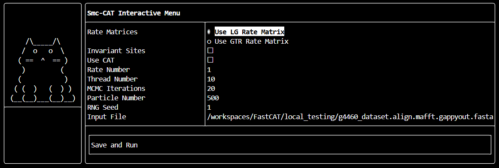

# About
Smc-CAT is a Sequential Monte Carlo (SMC) sampler for the computationally intensive phylogenetic CAT model. This model is a Dirichlet process mixture of phylogenetic Markov chains - each with a different stationary distribution. The goal of this software was to implement the CAT model in a sampling algorithm that is efficient and embarrasingly parallel to improve the computational problems associated with the model. Unlike Markov Chain Monte Carlo, SMC is easily parallelizable - although when it comes to phylogenetic models this results in pretty "heavy" particles.

# Required Libraries
- Boost
- Eigen3
- OpenMP
- (Optionally FtxUI)

# Usage
Smc-CAT comes both with a terminal user interface (TUI) and a typical command line interface. If no options for the command line interface are entered, the TUI will be activated.
**Minimum Smc-CAT Usage:**

```
smccat -a <fasta_file> -LG
smccat -a <fasta_file> -GTR
```

**Smc-CAT Command Line Arguments:**

- `-a <fasta_file>`  
  Specifies the alignment for the analysis.

- `-t <num_threads>`  
  Specify the number of threads to dedicate to the analysis.

- `-p <num_particles>`  
  Specify the number of particles to use during SMC.

- `-r <num_iter>`  
  Specify the number of rejuvenation iterations to use during SMC.

- `-s <seed>`  
  Specify the RNG seed to use for your analysis.  
  This is important to set if you are doing multiple analyses!

- `-LG`  
  Use the LG rate matrix.

- `-GTR`  
  Infer an amino acid GTR matrix.

- `-I`  
  Use invariant sites mixture.

- `-G <num_rates>`  
  Specify the number of discretized rate categories in the rate mixture.

- `-C`  
  Use the CAT mixture model.


